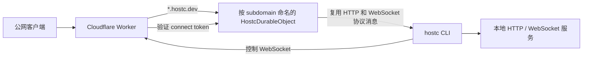

# WebSocket Tunnel 重构最佳实践

最后审阅日期：2026-05-08

> 历史说明：本文是重构前的评审笔记，不再作为当前实现规格。当前 tunnel 重构的唯一规格来源是 [`docs/refactor/`](./refactor/)。

本文档记录重构前 `hostc` monorepo 的问题和改造建议。它保留为历史参考，不描述当前重构后的目录结构或验收要求。

## 1. 重构前状态

### 仓库结构

- `apps/workers`：Cloudflare Worker 入口、Hono API 路由、Durable Object tunnel 协调器、静态资源、D1 waitlist 和 CLI 错误上报。
- `apps/cli`：Node.js CLI。负责创建控制 WebSocket、代理 HTTP 到本地服务、代理本地 WebSocket、刷新 session，并在断线后自动重连。
- `packages/tunnel-protocol`：共享协议包。包含协议消息类型、解析器、URL helper 和兼容性测试。

### 当前运行时架构



### 值得保留的设计

- 一个 tunnel subdomain 对应一个 Durable Object，这是正确的协调粒度。公网 HTTP 请求、公网 WebSocket upgrade、CLI 控制 WebSocket 都汇聚到同一个单线程对象。
- Worker 在控制 WebSocket 进入 Durable Object 前，会先验证 session token 和 connect token。
- Durable Object 已经使用 `this.ctx.acceptWebSocket(...)`、tag 和 serialized attachment，这是支持 Durable Object WebSocket hibernation 的正确基础。
- HTTP body 使用分块流式转发，没有把完整 body 一次性读进内存。
- 协议已经具备版本与 capability 协商，包括 `binary-payload` 和 `response-body-credit`。
- response backpressure 已通过 credit 机制显式建模，两端也都会检查 WebSocket `bufferedAmount`。
- `wrangler.jsonc` 已经启用 `nodejs_compat`、observability、source maps、wildcard routes，并使用 Wrangler 生成绑定类型。

### 当前重构风险

- 当前 `binary-payload` 协议是“文本元数据帧 + 下一帧二进制 payload”。Durable Object 把待处理元数据存在内存变量 `pendingControlBinaryPayload` 中。如果 Durable Object 在这两帧之间 hibernate，二进制 payload 会丢失对应元数据。重构时应优先修复。
- `POST /api/tunnels` 当前是匿名创建 tunnel，且 tunnel API 路径没有专门限流。可以保留 zero-config 体验，但必须增加滥用防护。
- `pendingResponses`、`pendingUpgrades` 和 active proxy WebSockets 需要按 tunnel 设置上限。单个 tunnel 不应无限积累公网请求或 WebSocket upgrade。
- 控制 WebSocket 鉴权当前使用短期 query token。它很方便，但 query token 可能出现在日志或复制的 URL 中。建议迁移到 `Authorization: Bearer`，同时在过渡期保留 query token 兼容。
- 当前 `compatibility_date` 是 `2026-04-15`，已经处在 Cloudflare 2026-04-07 之后的新 WebSocket close 行为下。close 传播逻辑需要补充明确的兼容性测试。

## 2. 目标架构

最佳目标形态仍然是 Worker front door 加每个 tunnel 一个 Durable Object。

### Worker 职责

- 将主应用域名流量路由到 Hono API 和静态资源。
- 将 `*.PUBLIC_BASE_DOMAIN` 流量路由到对应 subdomain 的 Durable Object。
- 在触达 Durable Object 前先处理低成本失败：
  - hostname 与 subdomain 格式校验。
  - connect 路径和公网 WebSocket 路径的 upgrade header 校验。
  - connect token 或 Authorization header 校验。
  - request method、body size policy、rate limit 决策。
- 签发短期 session token 和 connect token。
- 非 secret 配置放在 `wrangler.jsonc`；`TOKEN_SECRET` 只放在 Wrangler secret。
- 输出结构化日志，包含 request id、tunnel id、close code、错误类别和耗时。

### Durable Object 职责

- 为一个 subdomain 拥有完整的 tunnel 运行时状态。
- 只允许一个 active CLI control WebSocket，新连接应确定性替换旧连接。
- 每次公网 WebSocket upgrade 对应一个 public proxy WebSocket。
- 通过控制连接复用 HTTP request stream 和公网 WebSocket frame。
- 强制执行每个 tunnel 的资源上限：
  - 最大 pending HTTP request 数。
  - 最大 active public WebSocket 数。
  - 单请求最大 request body 字节数。
  - 如果 hosted plan 需要，设置单 response 最大字节数。
  - 协议 frame 最大值必须低于 Cloudflare 平台限制。
- 只从 socket tag 和 attachment 中恢复 hibernation-safe 状态。
- 把内存里的 map 当作 live event cache，而不是 durable truth。

### CLI 职责

- 创建 tunnel，连接控制 WebSocket，并完成协议协商。
- 使用流式 request body 和 response body 代理 HTTP。
- 使用 Node `ws` 或其他维护良好的 WebSocket client 代理本地 WebSocket upgrade。
- 在继续读取本地服务或发送 tunnel frame 前应用本地 backpressure。
- 在 session 过期前刷新，并使用带 jitter 的 backoff 重连。
- 上报错误前清理敏感信息并隐藏 token。

## 3. 协议设计

### 保留独立协议包

继续让 `packages/tunnel-protocol` 作为协议的唯一事实来源。它应该负责：

- 消息类型定义。
- 每个消息的运行时校验。
- 协议版本常量。
- capability 名称。
- close code 规范化。
- 如果 Worker 和 CLI 需要完全一致的行为，也可以放 header 过滤 helper。
- golden compatibility tests。

### 版本模型

推荐使用严格的 major protocol version 加可增量扩展的 capabilities。

- `protocolVersion` 用于拒绝不兼容的 framing 或语义变化。
- `capabilities` 用于启用增量功能，例如 binary payload、compression、response credit、ping auto-response、request trailers。
- 新 Worker 至少应在一次发布周期内兼容上一个 CLI 版本。
- 新 CLI 应能连接旧 Worker，并通过 legacy capability fallback 工作。

推荐握手流程：

```text
Worker -> CLI: tunnel-ready { protocolVersion, capabilities, limits }
CLI -> Worker: client-ready { protocolVersion, capabilities, cliVersion }
Worker -> CLI: tunnel-accepted { protocolVersion, capabilities, tunnelConfig }
```

握手中建议带上协商后的限制：

- `maxFrameBytes`
- `requestBodyChunkBytes`
- `responseBodyCreditBytes`
- `maxConcurrentRequests`
- `maxConcurrentWebSockets`
- `idleTimeoutMs`

### 使用自描述二进制 frame

如果 Durable Object 需要可靠 hibernation，不要依赖“文本帧描述下一帧二进制 payload”的内存状态。

推荐二进制 frame 布局：

```text
byte 0      : frame kind，例如 1=request body，2=response body，3=websocket frame
byte 1      : flags，例如 binary/text/end/error
bytes 2..17 : request id，可以是 16 字节原始 UUID，也可以使用 length-prefixed utf8 id
bytes 18..n : payload
```

如果暂时继续保留“文本元数据 + 二进制 payload”的设计：

- 在 `webSocketMessage` 返回前，把 pending metadata 序列化到 WebSocket attachment。
- 二进制 frame 被消费后清理 attachment。
- attachment 必须控制在 Cloudflare 2,048 字节 serialized attachment 限制内。

长期看，自描述二进制 frame 更干净，也能消除一类 hibernation 边界问题。

### HTTP stream 消息

推荐 server-to-CLI 消息：

- `request-start`：method、path、过滤后的 headers、是否有 body、request limits。
- `request-body`：二进制 frame，或 base64 fallback。
- `request-end`：request body 完成。
- `request-cancel`：公网客户端断开，或 Worker policy 终止请求。

推荐 CLI-to-server 消息：

- `response-start`：status、status text、过滤后的 headers、是否有 body。
- `response-body`：二进制 frame，或 base64 fallback。
- `response-end`：response body 完成。
- `response-error`：本地 fetch 在请求已被接受后失败。

Backpressure 应采用 pull-based 模型：

- 只有公网 response stream 准备好接收更多字节时，Worker 才发放 response body credit。
- 协商启用 credit 后，CLI 不得在无 credit 时发送 response body 字节。
- 如果未来上传大文件是重要场景，request body 也可以使用同样的 credit 设计。

### WebSocket proxy 消息

推荐消息：

- `websocket-connect`：path、过滤后的 headers、请求的 subprotocols。
- `websocket-accept`：本地服务选中的 subprotocol。
- `websocket-reject`：本地握手失败。
- `websocket-frame`：文本或二进制 payload。
- `websocket-close`：code 和 reason。

规则：

- 必须准确保留 `Sec-WebSocket-Protocol` 协商语义。本地服务只能选择公网客户端请求过的协议。
- 转发到本地服务前，移除 hop-by-hop headers 和自动生成的 WebSocket handshake headers。
- 规范化 close code，并把 reason 限制在 123 字节以内。
- close 传播必须是幂等的，因为任何一端都可能先关闭。

## 4. Durable Object 与 WebSocket 最佳实践

### Hibernation

长连接 control socket 和 public proxy socket 应使用 Durable Objects WebSocket Hibernation API。

- 使用 `this.ctx.acceptWebSocket(server, tags)` 接受 socket。
- 使用 tag 做粗粒度查询，例如 `control`、`proxy`、`request:<id>`。
- 使用 `serializeAttachment` 保存必须跨 hibernation 存活的小型 per-socket metadata。
- 在 constructor 或 lazy path 中，通过 `this.ctx.getWebSockets(tag)` 和 attachment 重建内存 map。
- 避免在空闲对象中使用 `setInterval` 或不必要的 timer。Cloudflare 文档说明 timers、alarms 和 scheduled callbacks 会阻止 hibernation。
- 静态 ping/pong 这类不需要业务逻辑的心跳，优先用 `setWebSocketAutoResponse`。

当前代码已经使用了 tag 和 attachment。主要改进点是让 binary payload 的中间状态也变成 hibernation-safe。

### 限制与流控

Cloudflare Durable Object 收到的 WebSocket message 大小限制是 32 MiB。应用层 frame 应远小于这个限制。

推荐默认值：

- tunnel 协议 frame target：32 KiB 到 64 KiB。
- 最大可接受协议 frame：默认 1 MiB，除非有明确强需求。
- 每个 tunnel 最大 active public WebSocket：先从 50 到 200 开始，再根据生产数据调整。
- 每个 tunnel 最大 pending HTTP request：先从 50 开始。
- request start 最大等待时间：30 秒是合理起点。
- 增加 response idle timeout 和 local WebSocket handshake timeout。

### 单线程对象模型

单个 Durable Object 是单线程的，这非常适合 tunnel 协调，但不是无限容量。Cloudflare 文档提到单个对象大约有 1,000 requests/s 的 soft limit。扩展方式应是创建更多 tunnel objects 横向扩展，而不是让单个 object 承担过多连接。

### Close 行为

本项目使用 `compatibility_date: "2026-04-15"`，因此 Cloudflare 较新的自动 WebSocket close reply 行为已经生效。tunnel 应做到：

- 把 `close` handler 当作通知，而不是依赖它手动完成 close handshake。
- 重复 close message 必须无害。
- 为公网客户端先关闭、本地服务先关闭、control socket 掉线、tunnel 替换增加测试。
- 如果未来某条路径使用标准 Worker WebSocket API 做 proxy，需要评估是否要使用 `allowHalfOpen: true` 来独立协调两侧 close。

## 5. 安全最佳实践

### Token 模型

保留当前双 token 概念，但做加强：

- Session token：生命周期稍长，只用于刷新 tunnel session。
- Connect token：生命周期很短，用于建立一次 control WebSocket。
- 使用 Web Crypto HMAC SHA-256 签名 token。
- token payload 包含 version、tunnel id、expiry、issued-at、nonce 和 audience。
- CLI 控制 WebSocket 鉴权优先使用 Authorization header。
- 日志、CLI 错误上报和异常消息中必须隐藏 token。

如果后续发现滥用，可以考虑一次性 connect token。一次性 replay prevention 需要状态，例如 Durable Object storage、D1，或带短 TTL 的 KV。如果坚持无状态，connect token TTL 必须很短，并配合 rate limit。

### 公网 tunnel 访问控制

公网 URL 的目标就是公开访问，但生产环境仍需要护栏：

- 按 IP 和 User-Agent 限制 tunnel 创建频率。
- 按 tunnel 和 source IP 限制公网请求频率。
- 如果引入账号体系，按账号或匿名 IP 限制 active tunnel 数。
- 增加可选访问控制：
  - Basic auth 或 bearer secret。
  - 临时分享密码。
  - IP allowlist。
  - 私有部署或自托管场景可使用 Cloudflare Access。
- 在 custom subdomain 前，先实现 reserved subdomain ownership。

### Header 处理

继续移除 hop-by-hop headers：

- `connection`
- `keep-alive`
- `proxy-authenticate`
- `proxy-authorization`
- `te`
- `trailer`
- `transfer-encoding`
- `upgrade`
- 自动生成的 WebSocket handshake headers

同时建议：

- 添加 `x-forwarded-host`、`x-forwarded-proto`、`x-forwarded-for`，可选 `x-real-ip`。
- 决定是否转发 `cf-*` headers。默认不转发，除非明确需要。
- 保留重复 header 的顺序或数组语义。当前 `HeaderEntry[]` 是不错的结构。

## 6. 可观测性

继续使用结构化 JSON 日志。建议统一字段：

- `event`
- `requestId`
- `tunnelId`
- `connectionId`
- `protocolVersion`
- `capabilities`
- `method`
- `path`
- `status`
- `durationMs`
- `bytesIn`
- `bytesOut`
- `closeCode`
- `error`

推荐事件：

- `tunnel.created`
- `tunnel.connect.accepted`
- `tunnel.connect.rejected`
- `tunnel.connected`
- `tunnel.replaced`
- `tunnel.closed`
- `proxy.http.started`
- `proxy.http.completed`
- `proxy.http.cancelled`
- `proxy.websocket.upgrade.started`
- `proxy.websocket.upgrade.accepted`
- `proxy.websocket.closed`
- `protocol.invalid_message`
- `protocol.backpressure.wait`

应跟踪的指标：

- active tunnels。
- active public WebSockets。
- pending HTTP requests。
- request duration percentiles。
- bytes transferred。
- local service failure rate。
- control reconnect rate。
- protocol parse failures。
- rate-limit decisions。

`wrangler.jsonc` 已启用 Cloudflare Workers Logs 和 Traces，生产环境应继续保持开启。如果日志成本过高或查询困难，可以考虑用 Analytics Engine 或 Queues 处理高基数使用事件。

## 7. 测试策略

### 协议包

- 单测每个消息 parser。
- 使用 golden test 验证向前/向后兼容。
- fuzz invalid messages、缺失字段、超长字符串和未知 capabilities。
- 使用随机 payload 测试二进制 frame encode/decode。

### Worker 与 Durable Object

推荐使用 `@cloudflare/vitest-pool-workers` 做 Worker-native 测试。

测试用例：

- 创建 tunnel 返回合法 public URL、session token 和 WebSocket URL。
- 无效 connect token 不应触达 Durable Object。
- control socket 替换会关闭旧 control socket 和 active proxy sockets。
- 没有 active tunnel 时，对浏览器返回 HTML，对 API client 返回 JSON。
- HTTP request body 能流式通过，不会完整缓冲。
- response body credit 能阻止 CLI 过量发送。
- 公网 WebSocket upgrade 能转发 requested protocols 和 selected protocol。
- 本地 WebSocket 拒绝时返回类似 502 的失败。
- 两个方向的 close propagation 都正确。
- Durable Object hibernation restore 能重建 control 和 proxy socket metadata。

### CLI

- 单测 URL normalization、host parsing、token redaction、update-check opt-out、close-code normalization。
- 使用本地 Worker，或 Workers test pool 做集成测试。
- 使用本地 HTTP fixtures：
  - 小 response。
  - streaming response。
  - upload body。
  - slow response start。
  - early client cancellation。
  - WebSocket echo。
  - WebSocket binary echo。
  - WebSocket subprotocol selection。

### 端到端测试

增加 smoke tests：

- `hostc 3000` 能暴露本地 HTTP fixture。
- 公网 WebSocket echo 能通过 tunnel 工作。
- 杀掉 CLI control socket 后能重连。
- 用第二个 CLI 替换 tunnel 时，第一个连接会被关闭。

## 8. 推荐技术栈

### Runtime 与平台

- Cloudflare Workers 作为公网 edge entrypoint。
- 使用 SQLite-backed Durable Objects 做每个 tunnel 的协调单元。
- Workers Static Assets 托管 web app 和静态 fallback 页面。
- D1 存储账号元数据、waitlist、错误上报、reserved subdomain 和未来 billing/account 记录。
- Cloudflare Rate Limiting binding 用于匿名 tunnel 创建和公网 tunnel 请求限流。
- Queues 用于非关键 analytics 或 abuse-processing 事件。
- Workers Logs 和 Traces 用于运维。

### Worker 代码

- TypeScript。
- Wrangler 4.x。
- `cloudflare:workers` base classes。
- Hono 用于 app/API 路由；高频 proxy path 保持简单、显式。
- 使用 `wrangler types` 生成 `Env`。
- `nodejs_compat` 只在确实需要 Node built-ins 时使用；Worker-native crypto 默认优先用 Web Crypto。

### CLI 代码

- 推荐目标 Node.js 20+；如果安装基数需要，再保留 Node.js 18+。
- `ws` 或其他维护良好、支持明确 `bufferedAmount` 的 WebSocket client。
- 原生 `fetch`、`ReadableStream` 和 `AbortController`。
- `commander` 用于 CLI 参数解析。
- `chalk` 或轻量 terminal output helper。
- CLI 是安装即用的开发者工具，依赖面应尽量小。

### 协议与校验

可选方案：

- 保留当前手写 parser，但补充更完整的测试。
- 或迁移到轻量 schema validator，例如 Valibot，获得运行时校验且 bundle 成本较低。

不要让协议 parser 过度宽松地接受未知 shape。tunnel 协议本身就是攻击面。

### Tooling

- pnpm workspaces。
- TypeScript project references 或 workspace builds。
- Biome 做格式化和 lint。
- `@cloudflare/vitest-pool-workers` 做 Worker 和 Durable Object 测试。
- 纯协议包和 CLI utility 测试可以继续用 Node 内置 test runner。
- 可选：`tsx` 或 `tsup` 用于本地 CLI 开发和打包。

## 9. 重构计划

### Phase 1：稳定边界

- 拆分 `apps/workers/src/durable/tunnel.ts` 为更聚焦的模块：
  - `protocol-adapter.ts`
  - `http-proxy.ts`
  - `websocket-proxy.ts`
  - `control-connection.ts`
  - `limits.ts`
  - `logging.ts`
- 把 Worker 和 CLI 共享的常量移动到 `packages/tunnel-protocol`。
- 在所有关键路径增加 `connectionId` 和 `requestId` 日志。
- 增加每个 tunnel 的最大 pending HTTP requests 和最大 active WebSockets。

### Phase 2：修复 hibernation 安全性

- 用自描述二进制 frame 替代“文本元数据 + 下一帧二进制 payload”。
- 或把 pending binary metadata 序列化到 control socket attachment。
- 增加 hibernation restore 测试。
- 如果 CLI 需要心跳流量，为静态 ping/pong 增加 `setWebSocketAutoResponse`。

### Phase 3：增强安全与滥用防护

- control connect 鉴权迁移到 `Authorization: Bearer`，query token fallback 保留一个发布周期。
- 对 `POST /api/tunnels` 做限流。
- 按 tunnel id 和 source IP 限制公网 tunnel 请求。
- 增加 tunnel-level concurrency 和 byte limits。
- 增加可选 tunnel access secret。

### Phase 4：改进 stream 行为

- 如果上传大文件是重要场景，增加 request body credit。
- 增加 response idle timeout 和 local WebSocket handshake timeout。
- 改进 cancellation，使公网断开能尽快 abort 本地 fetch。
- 增加 byte counters 和 completion logs。

### Phase 5：产品与运维

- 增加基于 D1 的 reserved/custom subdomains。
- 增加 account-aware quotas。
- 在 dashboard 中展示 active tunnel 状态。
- 通过 Queues 或 Analytics Engine 增加 analytics pipeline。

## 10. Cloudflare 专项 Checklist

- 保持 `compatibility_date` 更新，并且有意识地升级。
- 如果仍使用 Node built-ins，保留 `compatibility_flags: ["nodejs_compat"]`。
- 每次 binding 变化后，使用 `wrangler types` 重新生成 `worker-configuration.d.ts`。
- `TOKEN_SECRET` 只放在 Wrangler secrets，不放在源码或 `vars`。
- 在 Worker 中校验错误的 WebSocket upgrade 请求，避免无效请求触达 Durable Object。
- 需要 hibernation 的 Durable Object WebSocket 使用 `this.ctx.acceptWebSocket`，不要使用普通 `ws.accept`。
- 使用 tag 和 serialized attachment 做 hibernation restore。
- 不要在 Worker module global 中保存 request-scoped state。
- Promise 必须 `await`、`return`、带本地错误处理地 `void`，或交给 `ctx.waitUntil`。
- 大 body 必须流式处理，frame size 要显著低于平台限制。
- 保持结构化日志和 observability 开启。

## 参考资料

- [Cloudflare Workers 最佳实践](https://developers.cloudflare.com/workers/best-practices/workers-best-practices/)
- [Cloudflare Durable Objects：使用 WebSockets](https://developers.cloudflare.com/durable-objects/best-practices/websockets/)
- [Cloudflare DurableObjectState API](https://developers.cloudflare.com/durable-objects/api/state/)
- [Cloudflare Workers WebSockets API](https://developers.cloudflare.com/workers/runtime-apis/websockets/)
- [Cloudflare Durable Objects 限制](https://developers.cloudflare.com/durable-objects/platform/limits/)
